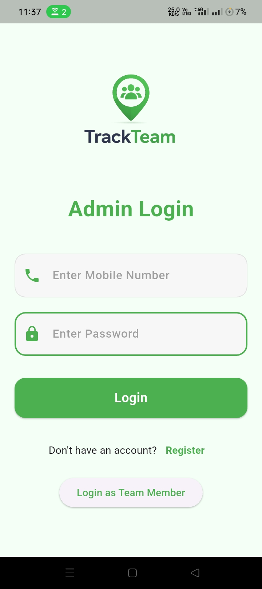
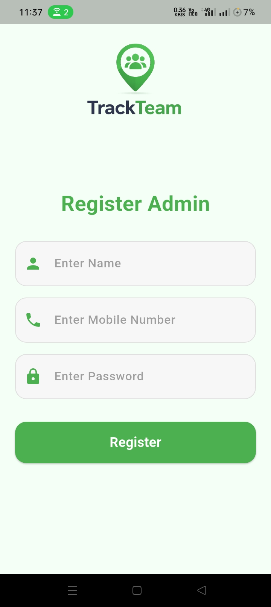
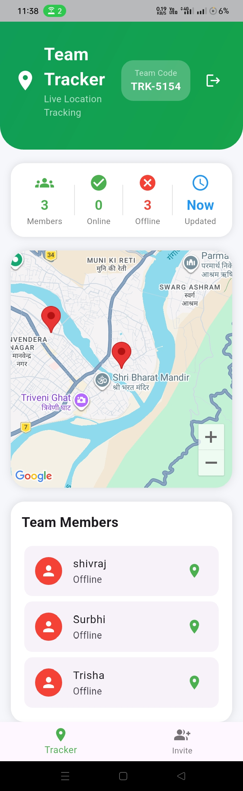
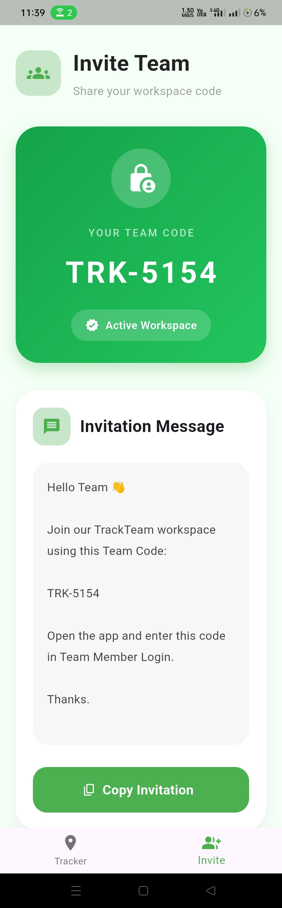
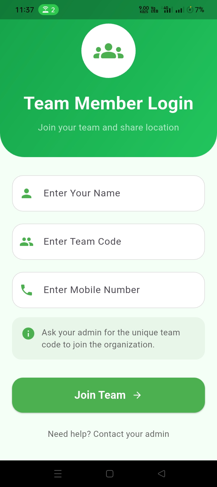
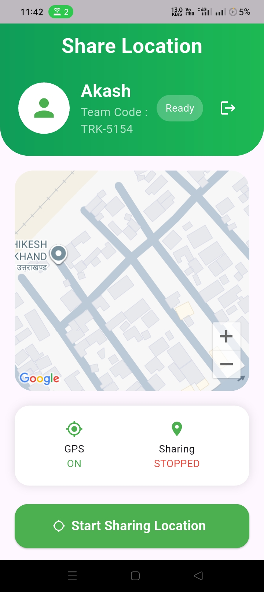

Live Team Tracking App

A Flutter-based real-time location tracking application that allows team members to share their live location and enables administrators to monitor all team members on a live map.

Features

Admin Side

- Admin Registration & Login
- Unique Team Code Generation
- Live Team Tracking Dashboard
- View Online/Offline Members
- Google Maps Integration
- Team Invitation System
- Secure Session Management

Team Member Side

- Join Team Using Team Code
- Live Location Sharing
- Real-time Location Updates
- Online/Offline Status Tracking
- Auto Login Using Shared Preferences
- Logout Functionality

Tech Stack

- Flutter
- Firebase Firestore
- Shared Preferences
- Google Maps Flutter
- Geolocator
- Firebase Core

Project Structure

lib/
- admin_side
  - login.dart
  - register.dart
  - dashboard.dart
  - team_track.dart
  - invite_team.dart
- team_members
  - share_location.dart
  - team_mem_login.dart
- firebase_options.dart
- main.dart
- routes.dart
- session_checker.dart

How It Works

1. Admin creates an account.
2. A unique Team Code is generated.
3. Team members join using the Team Code.
4. Members start sharing location.
5. Admin can view all members on Google Maps in real-time.
6. Online and offline members are displayed separately.

## Application Preview

### Admin Login

### Admin Register

### Team Tracker

### Invite Team

### Member Login

### Member Location Permission

Installation

1. Clone the repository

git clone https://github.com/aadityakeshi616-code/live-tracking-app.git

2. Navigate to project folder

cd live-tracking-app

3. Install dependencies

flutter pub get

4. Configure Firebase

- Create Firebase Project
- Add Android App
- Download google-services.json
- Place it inside android/app/

5. Run the project

flutter run

Future Improvements

- Background Location Tracking
- Push Notifications
- Route History
- Team Chat
- Emergency SOS
- Geofencing

Author:

Aaditya Keshi

Flutter Developer